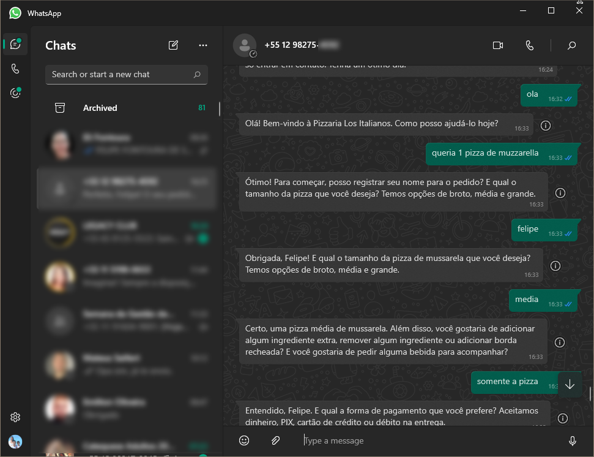

# Bot-WhatsApp-PedidosOnline

# Food Commerce GPT

Bot de atendimento para o Food Commerce utilizando modelo GPT da OpenAI. Projeto backend Node.js, TypeScript, Docker, é armazenamento em estruturas de dados Redis.

## Como funciona?

O bot utiliza o modelo GPT da OpenAI para gerar respostas para as perguntas dos usuários simulando um atendimento humano. Este atendimento é feito através do WhatsApp utilizando o [Venom](https://github.com/orkestral/venom).

Com este prompt você poderá adaptar o bot para o seu negócio ou para outros nichos, como clinicas, etc.



## Como executar?

Para executar o bot, você precisará de uma conta no WhatsApp, do [Node.js](https://nodejs.org/en/) e [Docker](https://www.docker.com/products/docker-desktop/) instalados.

Você irá precisar também de uma conta e API Key no [OpenAI](https://platform.openai.com/account/api-keys).

Com isso em mãos, você precisará criar um arquivo `.env` na raiz do projeto com as seguintes variáveis:

```env
OPENAI_API_KEY=sk-xxx <- Sua API Key do OpenAI
REDIS_HOST=localhost
REDIS_PORT=6379
REDIS_DB=0
```
Navegue até a pasta do projeto na raiz levantar os contêiners de armazenamento de dados:

```bash
docker-compose up -d
```

Após isso, você precisará instalar as dependências do projeto:

```bash
npm install
```

E então, executar o bot:

```bash
npm run dev
```
O localhost disponível é: 
```bash
http://localhost:8002
```

Para que você possa testar o bot, você precisará de um aplicativo do WhatsApp instalado no seu celular e escanear o QR Code que será gerado no terminal.
Após conectado o WhatsApp sera seu atendente automático virtual. Mandem mensagem de outro numero para inciar o atendimento.
